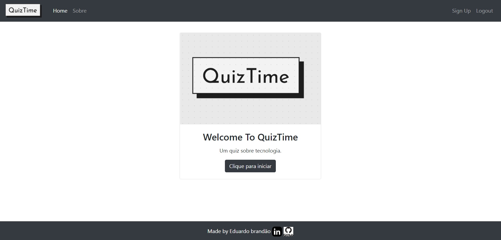

# App QuizTime
Este repositório trata-se de um projeto inicial para um quiz interativo.

# APRESENTACAO
Construir uma aplicação web para que o usuário seja capaz de:
- Visualizar o layout da pagina independente do tamanho da tela do dispositivo;
- Visualizar e responder perguntas do quiz;
- Visualizar quantas perguntas acertou ou errou e a exibição da sua nota.
- Ser capaz de realizar um cadastro de usuario;
. Efetuar login com o usuário cadastrado;
. Fazer uma busca nos nomes cadastrados através do campo de busca;

# METODOLOGIA
Aplicação de conceitos em:
- Python
- Django
- HTML;
- CSS;
- Bootstrap;
- Layouts Responsivos.
- Banco de Dados

# SCREENSHOT DO PROJETO

# LINK DO PROJETO
Para visualizar o projeto no seu navegador utilize o link abaixo:

https://quiz-django-edu.herokuapp.com
